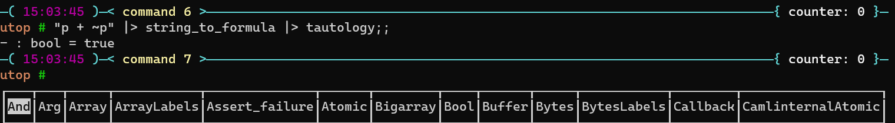

# Logic Lab in Ocaml

The solution of one of the labs on functional programming.



Dans ce TP nous allons essayer d'automatiser la résolution d'énigmes logiques avec l'aide d'`OCaml`. Vous étudierez
d'avantage la logique au deuxième semestre pendant le cours d'introduction à la logique qui utilisera `OCaml` pour décrire les différents
algorithmes.

## Vue d'ensemble

[Raymond Smullyan](https://en.wikipedia.org/wiki/Raymond_Smullyan) était un logicien qui était célèbre pour ses livres d'énigmes logiques.
Dans plusieurs de ses livres, Edgar Abercrombie visite une île, l'île des chevaliers et des valets, dans laquelle les habitants sont
soit des chevaliers, soit des valets, et les chevaliers disent toujours la vérité tandis que les valets mentent toujours.

Edgar Abercombrie est un anthropologiste et va donc questioner les habitants de cette île pour en apprendre d'avantage sur leurs us et coutumes.

Lors d'une visite, Edgar rencontre deux habitants `A1` et `A2` et `A1` lui dit que `A1 et A2 sont tous les deux des valets`. Edgar voudrait savoir si on peut
en déduire le type (chevalier ou valet) de ces deux habitants. Pouvez-vous l'aider ?^[Si `A1` est un chevalier, ce qu'il dit doit être vrai et alors il doit être un valet. `A1` ne peut
donc pas être un chevalier et c'est donc un valet et il ment. Du coup, sa phrase est fausse et `A1` et `A2` ne peuvent pas tous les deux être des valets et donc `A2` est un chevalier.]

On voudrait pouvoir automatiser la résolution de ce genre de questions. Pour ce faire, nous allons tout d'abord présenter quelques notions de
[logique propositionnelle](https://fr.wikipedia.org/wiki/Calcul_des_propositions).

Dans la logique propositionnelle, nous considérons deux valeurs, la valeur vraie que nous noterons `true` ou $\top$, et la valeur fausse
que nous noterons `false`ou $\bot$.

Une variable propositionnelle est une variable qui peut ne prendre que deux valeurs : `false` ou `true`.

Les variables propositionnelles sont assemblées grâce aux connecteurs : $\lor$, $\land$, $\neg$, $\Rightarrow$, $\Leftrightarrow$^[Le connecteur $\neg$ à la plus forte
priorité et est associatif à droite, ensuite vient le connecteur $\land$ qui est associatif à gauche, puis le connecteur $\lor$ qui est associatif à gauche, ensuite les connecteurs $\Rightarrow$ et $\Leftrightarrow$ ont la même priorité et
sont associatifs à droite.]. Les tables suivantes
donnent le sens de ces connecteurs.

<center>

| $p$                | $\neg p$           |
| :----------------: | :----------------: |
| false              | true               |
| true               | false              |


| $p$                | $q$                | $p \lor q$         | $p\land q$ | $p\Rightarrow q$ | $p\Leftrightarrow q$ |
| :----------------: | :----------------: | :----------------: | :--------: | :--------:       | :--------:           |
| false              | false              | false              | false      | true             | true                 |
| false              | true               | true               | false      | true             | false                |
| true               | false              | true               | false      | false            | false                |
| true               | true               | true               | true       | true             | true                 |

</center>

On peut alors évaluer une formule quelconque en évaluant d'abord les sous formules. Par exemple la formule
$$
(p \land q) \Rightarrow p
$$

s'évalue comme suit.

<center>

| $p$                | $q$                | $p\land q$ | $(p \land q) \Rightarrow p$ |
| :----------------: | :----------------: | :--------: | :--------:                  |
| false              | false              | false      | true                        |
| false              | true               | false      | true                        |
| true               | false              | false      | true                        |
| true               | true               | true       | true                        |

</center>

On peut remarquer que cette formule est vraie pour n'importe quelle valeur de $p$ et $q$, on dit que cette formule est une
**tautologie** dans ce cas particulier.

Revenons maintenant à notre énigme. Nous allons la formaliser dans le langage des propositions.

* Soit `c1` la proposition qui est vraie si `A1` est un chevalier et fausse si `A1` est un valet.
* Soit `c2` la proposition qui est vraie si `A2` est un chevalier et fausse si `A2` est un valet.
* L'énoncé de l'énigme peut se modéliser par la proposition $c1 \Leftrightarrow (\neg c1 \land \neg c2)$ qui doit être vraie
car c'est la réalité de ce monde qu'elle décrit. L'opérateur $\Leftrightarrow$ nous permet
d'exprimer que $c1$ est vrai si et seulement si ce que dit $c1$ : ($\neg c1 \land \neg c2$) est vrai. Cela représente
bien la situation qui nous a été décrite.

Nous allons maintenant écrire la table de vérité de cette formule et voir si nous obtenons bien la solution de l'énigme.

<center>

| $c1$            | $c2$               | $\neg c1 \land \neg c2$ | $c1 \Leftrightarrow (\neg c1 \land \neg c2)$ |
| :----------------: | :----------------: | :--------:                 | :--------:                                         |
| false              | false              | true                       | false                                              |
| false              | true               | false                      | true                                               |
| true               | false              | false                      | false                                              |
| true               | true               | false                      | false                                              |

</center>

On peut voir que la seule ligne où notre formule modélisant le problème est vraie est celle où `c1 = false` et `c2 = true`. On retrouve bien
notre conclusion qui était que `A1 est un valet` et `A2 est un chevalier`.


## Mise en oeuvre

Nous allons maintenant mettre en oeuvre quelques fonctions nous permettant de trouver les valeurs à attribuer aux variables propositionnelles
d'une formule logique afin de la rendre vraie. Nous verrons aussi comment essayer de transformer une formule dans une forme équivalente pour
la rendre plus lisible.

Vous pouvez télécharger le fichier `logique.ml` qui se trouve [ici](https://moodle.insa-rennes.fr/mod/resource/view.php?id=26172). Ce fichier comporte déjà tout un ensemble de fonctions pour vous aider à lire et écrire des
formules logiques et mettre en place des tests unitaires.

La définition d'une formule logique se trouve à la ligne 104 du fichier `logique.ml`. Nous la reproduisons ci-dessous.

```ocaml
type formula =
  | True
  | False
  | P of string
  | Not of formula
  | And of formula * formula
  | Or of formula * formula
  | Imp of formula * formula
  | Iff of formula * formula
```

Dans ce type, `True` représente la valeur de vérité `true`, `False` la valeur de vérité `false`, `P x` représente une variable propositionnelle dont le nom
est `x`, `Not` représente $\neg$, `And` représente $\land$, `Or` représente $\lor$, `Imp` représente $\Rightarrow$ et `Iff` représente $\Leftrightarrow$.
Par exemple, la formule représentant l'énigme s'écrit comme suit.

```ocaml
Iff (P "c1", And (Not (P "c1"), Not (P "c2")))
```

Ce n'est pas très pratique d'écrire dans cette représentation. C'est pourquoi nous vous fournissons une fonction `string_to_formula` définie à la ligne 214 du fichier
`logique.ml` qui vous permet d'écrire plus succintement une formule sous forme de chaîne de caractères. Par exemple, pour écrire la formule de l'énigme on fera

```ocaml
# string_to_formula "c1 <=> (~c1 . ~c2)";;
- : formula = Iff (P "c1", And (Not (P "c1"), Not (P "c2")))
```

La fonction `string_to_formula` attend la chaîne `"<=>"` pour le symbol $\Leftrightarrow$, la chaîne `"=>"` pour le symbol $\Rightarrow$, la chaîne `"."` pour
le symbol $\land$, la chaîne `"+"` pour le symbol $\lor$ et la chaîne `"~"` pour le symbol $\neg$.


On vous fourni aussi une autre fonction `formula_to_string`, définie à la ligne 220 du fichier `logique.ml`, qui
permet de passer d'une formule à une chaîne de caractères.
```ocaml
# formula_to_string @@ Iff (P "c1", And (Not (P "c1"), Not (P "c2")));;
- : string = "c1 ⇔ ¬c1 ∧ ¬c2"
```

Le type suivant (ligne 114 de `logique.ml`) permet de représenter une valuation, c'est-à-dire une association entre le nom d'une proposition et sa valeur de vérité.

```ocaml
type valuation = (string * bool) list
```

Par exemple, la valuation suivante permet d'associer la valeur `true` à la proposition atomique de nom `"p"` et la valeur `false` à la proposition atomique
de nom `"q"`.

```ocaml
# let v : valuation = ["p", true; "q", false];;
val v : valuation = [("p", true); ("q", false)]
```

On vous donne la fonction suivante (ligne 222 de `logique.ml`) qui permet de donner la valeur de vérité associée à une proposition atomique.

```ocaml
val get_value : string -> valuation -> bool
```

Par exemple,

```ocaml
# let v = ["p", true; "q", false];;
val v : valuation = [("p", true); ("q", false)]
# get_value "p" v;;
- : bool = true
# get_value "z" v;;
Exception: Not_found.
```

### Évaluation d'une formule

Nous allons automatiser l'évaluation d'une formule grâce à la fonction suivante.

```ocaml
val eval : formula -> valuation -> bool
```

Par exemple,

```ocaml
# let fm = string_to_formula "p1 => ~(p2 + p1 . p3)";;
val fm : formula = Imp (P "p1", Not (Or (P "p2", And (P "p1", P "p3"))))
# let v = ["p1", false; "p2", false; "p3", true];;
val v : (string * bool) list = [("p1", false); ("p2", false); ("p3", true)]
# eval fm v;;
- : bool = true
```

Une fois que vous avez écrit cette fonction, vous pouvez la tester en exécutant la fonction de test suivante.

```ocaml
# test_eval ();;
```

### Collecte des propositions atomiques d'une formule

Nous allons avoir besoin pour deux des questions suivantes d'obtenir la liste des propositions atomiques d'une formule. Nous allons
créer la fonction suivante qui va faire cela.

```ocaml
val atoms : formula -> string list
```

Par exemple,

```ocaml
# let fm = string_to_formula "p1 => ~(p2 + p1 . p3)";;
val fm : formula = Imp (P "p1", Not (Or (P "p2", And (P "p1", P "p3"))))
# atoms fm;;
- : string list = ["p1"; "p2"; "p3"]
```

Notez que la liste obtenue ne contient pas de doublon. Vous pouvez utiliser la fonction `sort_uniq` du module `List` avec la fonction générique de comparaison `compare`
pour enlever les doublons.


Vous pouvez tester votre fonction en exécutant la fonction de test suivante.

```ocaml
# test_atoms ();;
```

### Tautologies

Nous voudrions savoir si une formule est une tautologie, c'est-à-dire qu'elle est vraie pour toutes les valuations possibles de ses propositions atomiques.
Par exemple, la formule $p \lor \neg p$ est une tautologie. Elle est vraie lorsque $p = false$ et aussi lorsque $p = true$.
Le prototype de la fonction que vous devez
concevoir est donnée ci-dessous.

```ocaml
val tautology : formula -> bool
```

Par exemple,

```ocaml
# let fm = string_to_formula "p => q => p";;
val fm : formula = Imp (P "p", Imp (P "q", P "p"))
# tautology fm;;
- : bool = true
```

Vous pouvez tester votre fonction en exécutant la fonction de test suivante.

```ocaml
# test_tautology ();;
```

Notons que la fonction `tautology` nous permet de tester facilement si deux formules sont équivalentes, c'est-à-dire qu'elles ont les mêmes valeurs de vérités pour
n'importe quelle valuation. Par exemple, si on veut tester si la formule $\neg (p \land q)$ est équivalente à la formule $\neg p \lor \neg q$, il suffit
d'exécuter les commandes suivantes.

```ocaml
# let fm = string_to_formula "~(p . q) <=> ~p + ~q";;
val fm : formula =
  Iff (Not (And (P "p", P "q")), Or (Not (P "p"), Not (P "q")))
# tautology fm;;
- : bool = true
```

### Affichage des valuations qui rendent vraie une formule

Nous voudrions maintenant coder une fonction nous permettant d'afficher toutes les valuations qui rendent vraies une formule donnée.
Nous pourrons alors nous servir de cette fonction pour résoudre les énigmes de Smullyan.


Écrire la fonction suivante qui va parcourir toutes les valuations possibles d'une formule et appliquer
la fonction `f` sur chaque valuations qui rendent vraies la formule `fm`.

```ocaml
let find_truth (f : valuation -> unit) -> (fm : formula) : unit = ...
```

Vous pouvez tester votre function en utilisant la fonction de test suivante.

```ocaml
# test_find_truth ();;
```

Nous vous donnons la fonction suivante (ligne 321 de `logique.ml`) qui permet d'afficher une valuation donnée.

```ocaml
val print_valuation : valuation -> unit
```

Par exemple,

```ocaml
# let v = ["p", true; "q", false; "r", true];;
val v : (string * bool) list = [("p", true); ("q", false); ("r", true)]
# print_valuation v;;
p:true q:false r:true
- : unit = ()
```

On pourra maintenant utiliser `find_truth` et `print_valuation` comme suit.

```ocaml
# let fm = string_to_formula "c1 <=> ~c1 . ~c2";;
val fm : formula = Iff (P "c1", And (Not (P "c1"), Not (P "c2")))
# find_truth print_valuation fm;;
c2:true c1:false
- : unit = ()
```

Notons que l'ordre dans l'affichage de l'évaluation n'a pas d'importance.


Vous pouvez maintenant essayer de modéliser les énigmes suivantes et utiliser `find_truth` et `print_valuation`
pour obtenir les solutions. Notons que chaque énigme n'a qu'une seule
réponse possible.

---

**Si je suis un chevalier alors il y a de l'or sur l'île.**

Pouvez vous trouvez le type de cette personne, et s'il y a de l'or sur l'île ?

---

**Le natif fait les deux assertions suivantes :**

* **Il y a de l'or sur l'île.**
* **S'il y a de l'or ici alors il y a aussi de l'argent.**

Pouvez vous trouvez le type de cette personne, et s'il y a de l'or, de l'argent sur l'île ?

---

**Il y a un procès sur l'île, et deux témoins A1 et A2 font les déclarations suivantes :**

* **A1 : Si je suis un chevalier et A2 un valet, alors l'accusé est coupable.**
* **A2 : Ce n'est pas vrai !**

Pouvez vous trouvez le type de A1 et A2, et si l'accusé est coupable ?

---

### Simplification de formules

Nous avons du mal à comprendre les formules qui contiennent des implications ($\Rightarrow$) et des équivalences ($\Leftrightarrow$). Nous n'aimons pas non plus
quand les négations ne sont pas collées aux propositions atomiques.
Nous voudrions transformer une formule en une forme équivalente, où les opérateurs $\Rightarrow$ et $\Leftrightarrow$ sont supprimés et où les négations sont au plus proche des propositions atomiques.

Nous connaissons les équivalences suivantes (on peut tester la validité de ces équivalences grâce à notre fonction `tautology`).

* $p \Rightarrow q$ est équivalent à $\neg p \lor q$.
* $p \Leftrightarrow q$ est équivalent à $(p \land q) \lor (\neg p \land \neg q)$.
* $\neg \neg p$ est équivalent à $p$.
* $\neg (p \land q)$ est équivalent à $\neg p \lor \neg q$.
* $\neg (p \lor q)$ est équivalent à $\neg p \land \neg q$.
* $\neg (p \Rightarrow q)$ est équivalent à $p \land \neg q$.
* $\neg (p \Leftrightarrow q)$ est équivalent à $(p \land \neg q) \lor (\neg p \land q)$.


Écrivez la fonction suivante qui permet de transformer une formule en une forme équivalente où les opérateurs $\Rightarrow$ et $\Leftrightarrow$ sont supprimés et
où les négations sont au plus proche des propositions atomiques^[Cette forme est appelée forme normale négative de la formule.].

```ocaml
val nnf : formula -> formula
```

Par exemple,

```ocaml
# let fm = string_to_formula "c1 <=> ~c1 . ~c2";;
val fm : formula = Iff (P "c1", And (Not (P "c1"), Not (P "c2")))
# nnf fm |> formula_to_string;;
- : string = "c1 ∧ ¬c1 ∧ ¬c2 ∨ ¬c1 ∧ (c1 ∨ c2)"
```

Vous pouvez tester votre fonction grâce à la fonction de test suivante.

```ocaml
# test_nnf ();;
```

On vous fournit la fonction `simpify` (ligne 401 de `logique.ml`) qui va permettre de simplifier la formule obtenue à partir de `nnf`. Par exemple, sur la formule de la toute
première énigme on obtient le résultat suivant.

```ocaml
# let fm = string_to_formula "c1 <=> ~c1 . ~c2";;
val fm : formula = Iff (P "c1", And (Not (P "c1"), Not (P "c2")))
# nnf fm |> simplify |> formula_to_string;;
- : string = "(c1 ∨ c2) ∧ ¬c1"
```

On peut voir assez facilement que pour que cette formule soit vraie, `c1` doit être égale à `false` pour que $\neg c1$ soit vraie,
et du coup `c2` doit être égale à `true` pour que $(c1 \lor c2)$ soit vraie.
